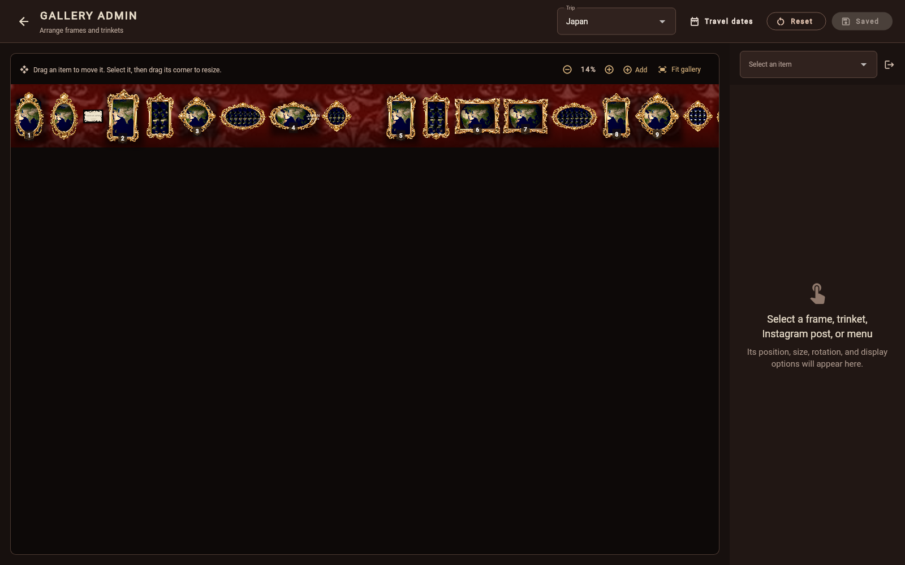

# EverAfter

EverAfter is a Flutter prototype for a local-first interactive museum of travel souvenirs. An idle museum display waits for an NFC-tagged artifact, opens an artifact intro, then moves into a calm exhibit flow with archival labels, paper texture, and collection browsing.

This public repository contains anonymous demo records and redistributable placeholder media only. Personal photos, videos, travel dates, NFC identifiers, and local design captures are intentionally excluded.

## What is implemented

- Flutter app scaffolded for Android, iOS, Linux, macOS, and web.
- Riverpod app state with a replaceable NFC service boundary.
- GoRouter routes for idle, artifact intro, exhibit, and collection catalogue.
- Anonymous seeded artifact data, clearly marked demo NFC UIDs, and a bundled fridge-magnet GLB.
- Custom-painted paper texture, ambient dust and light, rotating exhibit-object stage, Hero transitions, catalogue cards, and museum labels.
- Nine-second cinematic splash using the public-domain Erratic Cursive font and Texturelabs Paper 320.
- Public-safe gallery placeholders derived from NASA Blue Marble imagery and a generated abstract demo video.
- Widget tests for the idle museum and demo NFC-to-exhibit flow.

## Run the public demo

### Requirements

- [Flutter](https://docs.flutter.dev/get-started/install) with Dart 3.12.1 or
  later;
- Chrome for the quickest web preview, or a Flutter-supported desktop/mobile
  target configured on your machine.

Confirm the toolchain before starting:

```sh
flutter doctor
flutter devices
```

### Quick start

```sh
git clone https://github.com/thecodedose/everafter.git
cd everafter
flutter pub get
flutter run -d chrome
```

The first launch plays the museum introduction and then opens the trip gallery.
Click any trip card to explore it. The public demo uses bundled placeholder
media and works without an account, network connection, or NFC reader.

To use another configured device, copy its ID from `flutter devices`:

```sh
flutter run -d <device-id>
```

For example, `flutter run -d macos` starts the macOS desktop build and
`flutter run -d linux` starts the Linux desktop build when those targets are
available.

### Local gallery storage

EverAfter has no backend configuration. The shared baseline for every device is
[`assets/data/gallery_layouts.json`](assets/data/gallery_layouts.json), bundled
into the app at build time. Native devices can create a local override in
Flutter preferences under `everafter.gallery-layout.device-overrides.v1`.
Overrides contain only layout sections that differ from the global baseline.

There is no realtime or automatic sync. To distribute a global change, save the
JSON in browser admin, commit it if appropriate, then rebuild or redeploy each
device. Clearing application data removes that device's override and reveals
the bundled global layout again.

### Production web build

```sh
flutter build web --release
```

The static site is written to `build/web/`. Follow Flutter's
[web deployment guide](https://docs.flutter.dev/deployment/web) to serve it.

## Verify

```sh
dart format .
flutter analyze
flutter test
```

## Gallery admin

Open `/admin/gallery` in the app to arrange the cinematic gallery walls. The
browser automatically loads the bundled `assets/data/gallery_layouts.json` as
the editable global layout. The first **Save global** asks where to write the
JSON; select the source file and confirm replacement. Later saves in that
browser session reuse the same permission. In a native app, edits create only a
local override for that device. Physical access to the device or browser
profile is the access boundary.



The screenshot is rendered from the repository's public demo data and does not
contain travel dates or personal media.

### Curate a gallery

1. Choose a destination from the **Trip** menu. Use **Fit gallery** or the zoom
   controls to frame the full wall or inspect a section closely.
2. Select a frame, trinket, Instagram placeholder, title, or food menu directly
   on the canvas or from the item selector in the right-hand panel.
3. Drag the selected item to move it. Drag its highlighted corner to resize it,
   or enter exact position, size, scale, and rotation values in the inspector.
4. For frames, choose a frame style, update its public label, and use the photo
   editor to arrange only media that is safe for the intended audience. Items
   can also be hidden and restored from the item selector.
5. Use **Add** to create a frame or choose an existing bundled trinket. Browser
   uploads are disabled. To add source artwork, place PNG, JPEG, or WebP files
   in `assets/images/experience/`, add their paths to
   `galleryTrinketAssetChoices` in
   `lib/data/gallery_memory_content.dart`, and rebuild EverAfter. Add private
   trip photos under `assets/memories/<trip-slug>/` and register them in that
   trip's collection source and private asset manifest before rebuilding.
6. In browser admin, select **Save global**, choose
   `assets/data/gallery_layouts.json`, and confirm replacement on the first
   save. On a native device, select **Save this device** to retain an override
   only there. **Reset** restores the bundled baseline in browser admin or
   removes the selected trip's device changes on native.

Existing device snapshots migrate to the override format, including previously
embedded local trinkets. Legacy cloud-only trinket URLs are removed during
migration because their image bytes are not available offline.

## Privacy and public sharing

The Git boundary deliberately excludes:

- `assets/memories/`, imported trip photography, reels, manifests, and keepsake scans;
- exact travel dates and physical NFC tag identifiers;
- local application preferences and browser storage;
- model reference photos, design-QA captures, temporary files, logs, and generated CAD/mesh exports;
- audio and fonts whose licenses do not permit source redistribution.

See [`docs/PRIVATE_MEDIA.md`](docs/PRIVATE_MEDIA.md) before adding your own
collection. Run `git add -n .` before every public commit to confirm none of the
ignored local archive is entering Git.

The local data and device-access model is documented in
[`docs/SECURITY.md`](docs/SECURITY.md).

## NFC integration point

The app uses `DemoNfcService` by default. On Linux, setting
`EVERAFTER_NFC_MODE=pn532` activates `Pn532NfcService`, which repeatedly runs
`nfc-poll`, parses NFCID1 UIDs, suppresses immediate duplicate reads, and emits
them on the same `detectedUids` stream.

## Raspberry Pi OS — native application

Use a Raspberry Pi 4 or 5 with 64-bit Raspberry Pi OS Desktop and the current
Flutter Linux ARM64 stable SDK. The project now includes a GTK Linux runner; it
does not require Chromium or a local web server.

First configure the PN532 for `libnfc` using I2C, SPI, or UART and verify that
this command prints the tag UID:

```sh
nfc-poll
```

Then build and start the native fullscreen application:

```sh
./tool/build_pi.sh
./tool/run_pi.sh
```

The launcher defaults to `EVERAFTER_FULLSCREEN=1` and
`EVERAFTER_NFC_MODE=pn532`. For UI-only testing, run:

```sh
EVERAFTER_NFC_MODE=demo EVERAFTER_FULLSCREEN=0 ./tool/run_pi.sh
```

## Redistributable assets

- Paper 320: Texturelabs, free for commercial use.
- Erratic Cursive: GGBotNet, released under CC0/public domain.
- Earth imagery: NASA Visible Earth, public domain.
- Interaction sounds: generated specifically for EverAfter without third-party samples.

The downloaded font license texts are retained in `assets/licenses/`.
